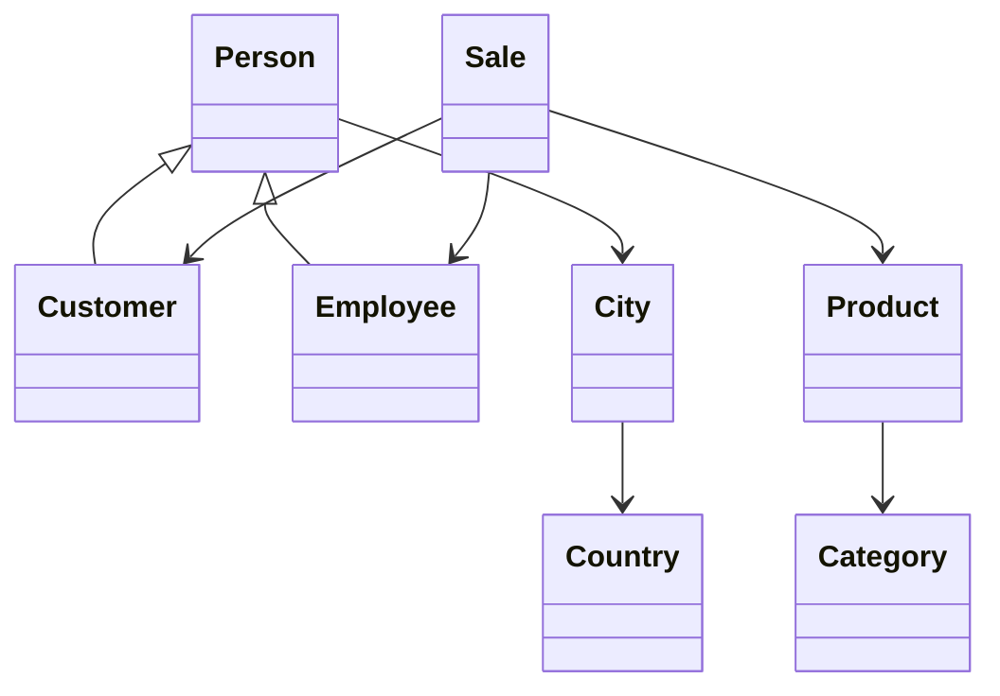

# Sistema de Análisis de Ventas

## Descripción del Proyecto

Este proyecto implementa un sistema de análisis de ventas para una startup con múltiples sucursales, utilizando Python y siguiendo los principios de Programación Orientada a Objetos (POO). El sistema está diseñado para gestionar y analizar datos de ventas, productos, clientes y empleados de manera eficiente y escalable.

## ¿Qué se hizo?

### 1. Modelado del Sistema
- Implementación de un modelo de datos robusto usando POO
- Desarrollo de clases para cada entidad del negocio
- Implementación de relaciones entre entidades
- Creación de métodos especializados para análisis de datos

### 2. Gestión de Datos
- Diseño de estructura de base de datos MySQL
- Scripts SQL para carga y manipulación de datos
- Manejo de formatos especiales de fechas
- Validación y limpieza de datos

### 3. Testing
- Implementación de pruebas unitarias completas
- Creación de fixtures para pruebas
- Cobertura de casos de uso principales
- Validación de lógica de negocio

## Organización del Proyecto

### Estructura de Directorios
```
proyecto/
│
├── src/                  # Código fuente
│   └── models/          # Modelos de datos
│       ├── __init__.py
│       ├── category.py  # Categorías de productos
│       ├── city.py      # Ciudades
│       ├── country.py   # Países
│       ├── customer.py  # Clientes
│       ├── employee.py  # Empleados
│       ├── person.py    # Clase base para personas
│       ├── product.py   # Productos
│       └── sale.py      # Ventas
│
├── data/                # Archivos de datos
│   ├── categories.csv
│   ├── cities.csv
│   ├── countries.csv
│   ├── customers.csv
│   ├── employees.csv
│   ├── products.csv
│   └── sales.csv
│
├── sql/                 # Scripts SQL
│   └── load_data.sql   # Carga inicial de datos
│
└── tests/              # Pruebas unitarias
    ├── conftest.py    # Fixtures comunes
    ├── test_city.py
    ├── test_country.py
    ├── test_employee.py
    ├── test_product.py
    └── test_sale.py
```

### Jerarquía de Clases


## Justificación Técnica

### 1. Elección de Tecnologías

#### Python como Lenguaje Principal
- **Ventajas**:
  - Excelente soporte para POO
  - Rica biblioteca estándar
  - Facilidad de mantenimiento
  - Gran comunidad y ecosistema
- **Uso en el Proyecto**:
  - Implementación de modelos de datos
  - Lógica de negocio
  - Testing

#### MySQL como Base de Datos
- **Ventajas**:
  - Robusto sistema de tipos
  - Soporte para relaciones
  - Buen rendimiento con grandes volúmenes
  - Herramientas de administración maduras
- **Uso en el Proyecto**:
  - Almacenamiento persistente
  - Consultas complejas
  - Integridad referencial

### 2. Decisiones de Diseño

#### Gestión de Dependencias con Poetry
- **¿Por qué Poetry en lugar de requirements.txt?**
  - **Gestión Determinista**:
    - Poetry garantiza que las dependencias sean exactamente las mismas en todos los entornos
    - Bloqueo de versiones específicas mediante `poetry.lock`
    - Evita el "funciona en mi máquina" mediante resolución determinista de dependencias

  - **Manejo de Entornos Virtuales**:
    - Creación y gestión automática de entornos virtuales
    - Aislamiento consistente del proyecto
    - No requiere comandos manuales de venv

  - **Gestión de Dependencias Avanzada**:
    - Diferenciación entre dependencias de desarrollo y producción
    - Resolución automática de conflictos entre dependencias
    - Manejo de dependencias opcionales y extras

  - **Publicación y Distribución**:
    - Facilita el empaquetado y publicación
    - Gestión de metadatos del proyecto en `pyproject.toml`
    - Compatibilidad con PEP 517/518

  - **Desarrollo Moderno**:
    - Integración con herramientas modernas de desarrollo
    - Soporte para type hints y mypy
    - Mejor experiencia de desarrollo con autocompletado

  - **Mantenibilidad**:
    - Archivo `pyproject.toml` más legible y estructurado
    - Versionado semántico explícito
    - Documentación de dependencias clara

  - **Ejemplo de Configuración en Nuestro Proyecto**:
    ```toml
    [tool.poetry]
    name = "sistema-ventas"
    version = "1.0.0"
    description = "Sistema de análisis de ventas para múltiples sucursales"
    authors = ["Data Engineer Team"]

    [tool.poetry.dependencies]
    python = "^3.9"
    pandas = "^2.0.0"
    mysql-connector-python = "^8.0.0"
    python-dateutil = "^2.8.2"

    [tool.poetry.group.dev.dependencies]
    pytest = "^7.0.0"
    pytest-cov = "^4.0.0"
    black = "^23.0.0"
    mypy = "^1.0.0"

    [build-system]
    requires = ["poetry-core>=1.0.0"]
    build-backend = "poetry.core.masonry.api"
    ```

  - **Comandos Comunes**:
    ```bash
    # Instalar dependencias
    poetry install

    # Activar entorno virtual
    poetry shell

    # Agregar nueva dependencia
    poetry add pandas

    # Agregar dependencia de desarrollo
    poetry add --group dev pytest

    # Actualizar dependencias
    poetry update

    # Ejecutar tests
    poetry run pytest
    ```

#### Patrón de Diseño POO
- **Beneficios**:
  - Encapsulamiento de datos
  - Reutilización de código
  - Mantenibilidad mejorada
  - Extensibilidad

#### Herencia vs Composición
- **Uso de Herencia**:
  - Clase base `Person` para compartir atributos comunes
  - Especialización en `Customer` y `Employee`
- **Uso de Composición**:
  - Relaciones entre entidades (City-Country, Sale-Product)
  - Mayor flexibilidad y menor acoplamiento

#### Serialización de Datos
- **Implementación**:
  - Métodos `to_dict()` y `from_dict()`
  - Conversión consistente entre objetos y JSON
  - Facilita integración con APIs

### 3. Patrones y Prácticas

#### Clean Code
- Nombres descriptivos
- Funciones pequeñas y enfocadas
- Documentación clara
- Separación de responsabilidades

#### SOLID Principles
- **Single Responsibility**: Cada clase tiene una única responsabilidad
- **Open/Closed**: Extensible sin modificar código existente
- **Liskov Substitution**: Herencia bien implementada
- **Interface Segregation**: Interfaces cohesivas
- **Dependency Inversion**: Dependencias mediante abstracciones

#### Testing
- **Estrategia**:
  - Pruebas unitarias exhaustivas
  - Fixtures reutilizables
  - Cobertura de código
  - Casos de borde

### 4. Escalabilidad y Mantenimiento

#### Modularidad
- Componentes independientes
- Fácil de extender
- Bajo acoplamiento

#### Gestión de Dependencias
- Uso de dataclasses
- Type hints para mejor IDE support
- Documentación inline

## Patrones de Diseño Implementados

En este proyecto se han implementado varios patrones de diseño para resolver problemas específicos y mejorar la arquitectura del sistema. A continuación, se detalla cada patrón y su justificación:

### 1. Patrón Singleton (DatabaseConnection)

**Problema que resuelve**: Gestionar una única conexión a la base de datos en toda la aplicación.

**Beneficios**:
- Evita múltiples conexiones innecesarias que podrían saturar el pool de conexiones
- Garantiza que todos los componentes usen la misma conexión
- Centraliza la gestión de la conexión y sus credenciales
- Facilita la implementación de reconexión automática y manejo de errores

**Implementación**: `src/patterns/database_singleton.py`

```python
# Ejemplo de uso
db = DatabaseConnection()
db.connect("localhost", "user", "pass", "ventas_db")
connection = db.get_connection()
```

### 2. Patrón Factory Method (ReportFactory)

**Problema que resuelve**: Crear diferentes tipos de reportes manteniendo un punto único de creación.

**Beneficios**:
- Encapsula la lógica de creación de reportes
- Facilita la adición de nuevos tipos de reportes sin modificar código existente
- Proporciona una interfaz común para todos los reportes
- Permite personalizar la lógica de creación según el tipo de reporte
- Facilita el testing al poder mockear la factory

**Implementación**: `src/patterns/report_factory.py`

```python
# Ejemplo de uso
report = ReportFactory.create_report("sales", sales_data, start_date=start, end_date=end)
report_data = report.generate()
```

### 3. Patrón Builder (SQLQueryBuilder)

**Problema que resuelve**: Construcción de consultas SQL complejas de manera segura y mantenible.

**Beneficios**:
- Permite construir consultas paso a paso de forma fluida
- Previene errores de sintaxis SQL
- Facilita la parametrización de consultas
- Separa la construcción de la representación
- Proporciona una API intuitiva para construir consultas

**Implementación**: `src/patterns/query_builder.py`

```python
# Ejemplo de uso básico
query_builder = SQLQueryBuilder()
query, params = (
    query_builder
    .select("product_id", "COUNT(*) as total")
    .from_table("sales")
    .where("sale_date >= :start_date", {"start_date": start_date})
    .group_by("product_id")
    .build()
)

# Ejemplo con builder especializado
sales_query = SalesQueryBuilder()
query, params = (
    sales_query
    .with_date_range(start_date, end_date)
    .with_product_category(5)
    .group_by_product()
    .build()
)
```

### Integración de los Patrones

Los patrones implementados trabajan en conjunto para proporcionar una arquitectura robusta:

1. El **Singleton** de la base de datos es utilizado por los **Builders** de consultas para ejecutar las consultas.
2. El **Factory Method** de reportes puede usar los **Builders** de consultas para obtener los datos necesarios.
3. Los **Builders** de consultas usan la única instancia de conexión proporcionada por el **Singleton**.

Este diseño sigue los principios SOLID:

- **Single Responsibility**: Cada clase tiene una única responsabilidad bien definida
- **Open/Closed**: El sistema es fácilmente extensible sin modificar código existente
- **Liskov Substitution**: Las subclases (como los diferentes tipos de reportes) son intercambiables
- **Interface Segregation**: Se definen interfaces específicas para cada propósito
- **Dependency Inversion**: Las dependencias apuntan hacia abstracciones, no implementaciones

La implementación de estos patrones ha resultado en un código más mantenible, extensible y robusto, facilitando futuras modificaciones y mejoras al sistema.

## Conclusiones y Mejoras Futuras

### Logros
- Sistema robusto y bien documentado
- Cobertura completa de pruebas
- Diseño extensible y mantenible

### Áreas de Mejora
- Implementar caché para optimizar consultas frecuentes
- Agregar logging para mejor debugging
- Desarrollar API REST para integración
- Implementar autenticación y autorización
- Agregar métricas de rendimiento

### Próximos Pasos
1. Implementar dashboard de análisis
2. Optimizar consultas complejas
3. Agregar reportes automatizados
4. Implementar sistema de notificaciones

## Configuración del Ambiente

### Variables de Entorno

El proyecto utiliza variables de entorno para la configuración. Sigue estos pasos para configurar tu ambiente:

1. Crea un archivo `.env` en la raíz del proyecto
2. Copia el siguiente contenido y ajusta los valores según tu configuración:

```env
# Ambiente de ejecución (development/production)
ENV=development

# Configuración de la base de datos
DB_HOST=localhost
DB_USER=tu_usuario
DB_PASSWORD=tu_password
DB_NAME=ventas_db
DB_PORT=3306

# Nivel de logging
LOG_LEVEL=INFO

# Clave secreta para tokens/encriptación
SECRET_KEY=tu-clave-secreta-aqui
```

**IMPORTANTE**: Nunca subas el archivo `.env` al repositorio. Este archivo contiene información sensible y está incluido en `.gitignore`.

### Instalación de Dependencias

El proyecto requiere python-dotenv para manejar las variables de entorno:

```bash
pip install python-dotenv
```

### Uso en el Código

La configuración se maneja a través del módulo `src/config.py`:

```python
from src.config import Config

# Usar configuración de base de datos
db = DatabaseConnection()
db.connect()  # Usa automáticamente las credenciales del .env

# Acceder a otras configuraciones
debug_mode = Config.DEBUG
log_level = Config.LOG_LEVEL
```

## Notebook de Demostración (demo_integracion.ipynb)

### Descripción General
El notebook `demo_integracion.ipynb` sirve como punto central de demostración del sistema, documentando y ejecutando todas las funcionalidades implementadas en cada avance del proyecto, con énfasis en las consultas SQL avanzadas y la demostración de objetos de base de datos.

### Resultados y Análisis
Cada sección del notebook incluye:
- Explicación detallada de la lógica SQL utilizada
- Justificación de las funciones ventana y CTEs empleadas
- Interpretación de los resultados obtenidos
- Casos de uso prácticos para cada consulta

### Ejecución del Notebook
```bash
# Activar entorno virtual
poetry shell

# Lanzar Jupyter
jupyter notebook demo_integracion.ipynb
```

### Consideraciones Importantes
1. **Requisitos Previos**:
   - Base de datos MySQL configurada y en ejecución
   - Datos de prueba cargados correctamente
   - Triggers y stored procedures creados
   - Permisos de usuario configurados

2. **Orden de Ejecución**:
   - Ejecutar la configuración inicial primero
   - Verificar la conexión a la base de datos
   - Ejecutar las consultas en orden secuencial
   - Validar los resultados de cada consulta

3. **Troubleshooting**:
   - Verificar las credenciales en el archivo `.env`
   - Confirmar que los triggers estén activos
   - Validar los permisos de MySQL para stored procedures
   - Revisar el log de errores de MySQL

4. **Mantenimiento**:
   - Actualizar las consultas si cambia el esquema
   - Verificar la eficiencia de las consultas complejas
   - Documentar cualquier modificación en las queries
   - Mantener actualizados los datos de prueba 
